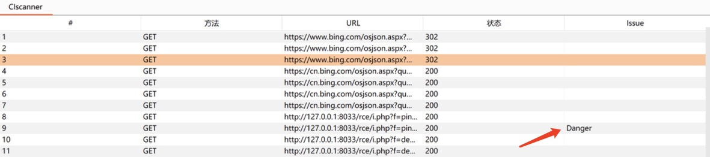
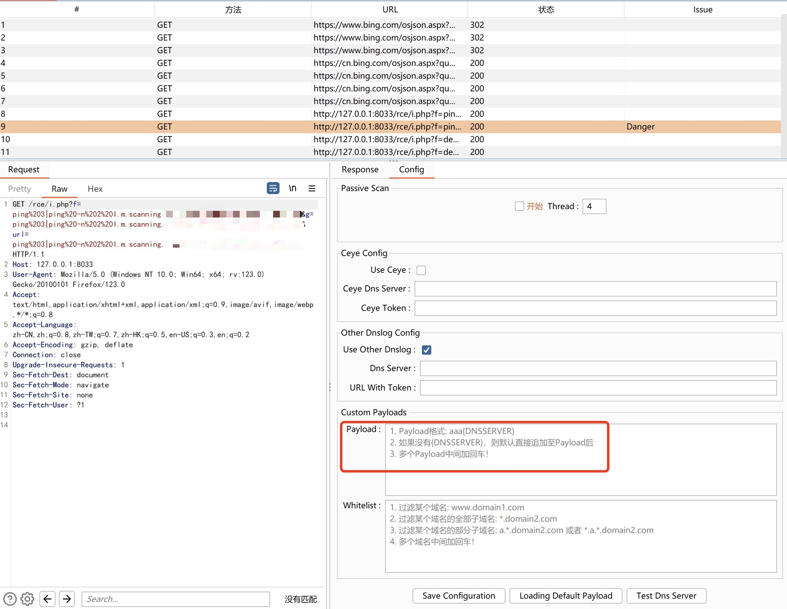

~~工具目前还是处于需要更新的状态，不过基础功能已经完备，就是扫描可能会有点慢（90度鞠躬道歉~~
 ~~目前会暂停更新，不过我会回来的！（敝帚自珍，一只菜猫的自知~~
 菜猫我回来了！省流版：代码优化，加了线程且线程可控

### 免责声明
该工具仅用于安全自查检测
由于传播、利用此工具所提供的信息而造成的任何直接或者间接的后果及损失，均由使用者本人负责，作者不为此承担任何责任。
本人拥有对此工具的修改和解释权。未经网络安全部门及相关部门允许，不得善自使用本工具进行任何攻击活动，不得以任何方式将其用于商业目的。

### 简介
* 工具利用`Java11`编写，其他版本暂未测试支不支持
* 使用需要开启BurpSuite的被动扫描
* 会修改并发送URL参数和请求体参数内的所有参数，请求体目前只支持`application/x-www-form-urlencoded`的数据类型
* 工具有两个版本，whitelist版本以及target版本
	* targetlist版本，仅扫描写入targetlist内的目标（建议使用这个版本，因为获取dnslog需要不断访问dnslog网站，如果网站被访问次数过多，会无法及时响应）

	* whitelist版本，过滤白名单内的目标

* 重中之重！工具外观及部分代码借鉴了[f0ng老师的log4j2burpscanner](https://github.com/f0ng/log4j2burpscanner)以及[P喵呜老师的BurpShiroPassiveScan](https://github.com/pmiaowu/BurpShiroPassiveScan)，感谢！

### 功能
会修改并发送URL参数和请求体参数内的所有参数，请求体目前只支持`application/x-www-form-urlencoded`的数据类型
 ~~目前只支持单线程，所以扫描比较慢，后续一定会改进（今日画大饼完成！~~
 支持多线程，且线程可控

### 使用截图
每次打开Burp需要选中Start，插件才会启动，线程默认是4，且仅支持填入1-10内的整数
 
 工具会在Burp目录下生成文件`CIScanner.properties`，用于记录配置信息
 
 工具会记录下每次改动的数据包，有漏洞的会标记`Danger`
 
 发现了漏洞也会在`Extensions`显示
 
 Payload格式: aaa{DNSSERVER}，如果没有{DNSSERVER}，则默认直接追加至Payload后
 

### 后续功能
* Accept 白名单增加