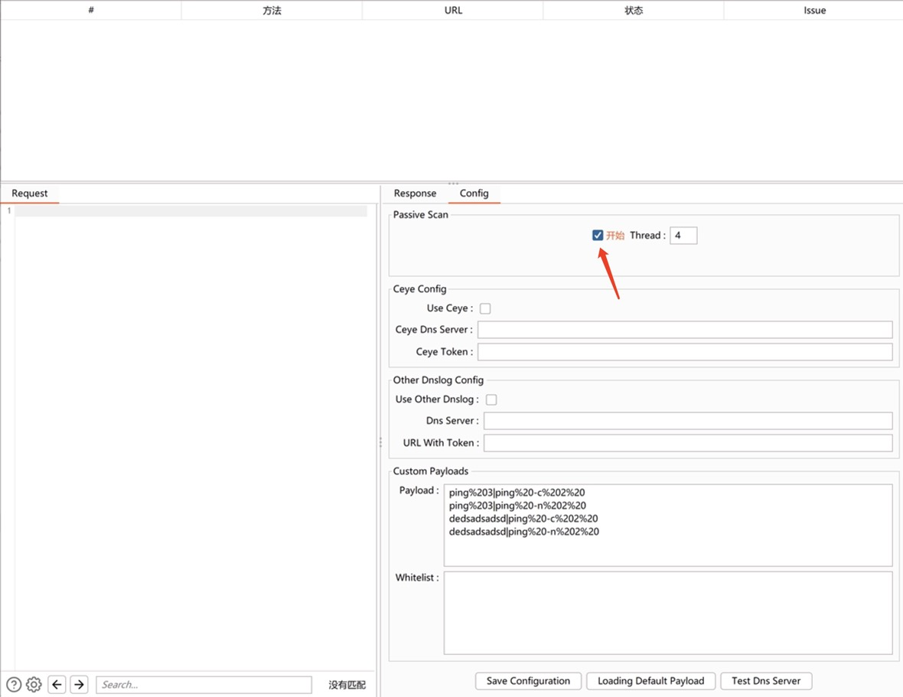

工具目前还是处于需要更新的状态，不过基础功能已经完备，就是扫描可能会有点慢（90度鞠躬道歉
目前会暂停更新，不过我会回来的！（敝帚自珍，一只菜猫的自知

### 免责声明
该工具仅用于安全自查检测
由于传播、利用此工具所提供的信息而造成的任何直接或者间接的后果及损失，均由使用者本人负责，作者不为此承担任何责任。
本人拥有对此工具的修改和解释权。未经网络安全部门及相关部门允许，不得善自使用本工具进行任何攻击活动，不得以任何方式将其用于商业目的。

### 简介
* 工具利用`Java11`编写，其他版本暂未测试支不支持
* 使用需要开启BurpSuite的被动扫描
* 重中之重！工具外观及部分代码借鉴了[f0ng老师的log4j2burpscanner](https://github.com/f0ng/log4j2burpscanner)以及[P喵呜老师的BurpShiroPassiveScan](https://github.com/pmiaowu/BurpShiroPassiveScan)，感谢！

### 功能
会修改并发送URL参数和请求体参数内的所有参数，请求体目前只支持`application/x-www-form-urlencoded`的数据类型，目前只支持单线程，所以扫描比较慢，后续一定会改进（今日画大饼完成！

### 使用截图
每次打开Burp需要选中Open，插件才会启动

工具会在Burp目录下生成两个文件`CIScanner.properties`和`CIScanner_SubDomain.txt`
`CIScanner.properties`：用于记录配置信息
`CIScanner_SubDomain.txt`：用于存储未在DnsLog检测到的域名，用于查漏补缺，满9条就会删除前5条（这也是扫描慢的主要原因）

工具会记录下每次改动的数据包，有漏洞的会标记`Danger`，
**ps：有一个Bug，只有拖动表格（下图红色指向的位置），表格里的数据才会在页面显示，菜猫我啊真的有点搞不来，如果有大神看到，求指点，提前感谢！**

发现了漏洞也会在`Extensions`显示

### 后续功能
* 多线程
* 表格数据的显示问题
* 黑名单功能